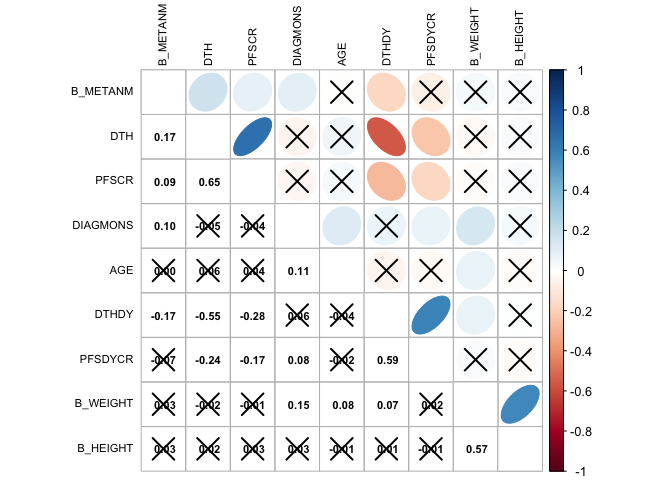

<!-- README.md is generated from README.Rmd. Please edit that file -->

# bis620.2023

<!-- badges: start -->

[](https://github.com/zihanwang00/bis620.2023/actions/workflows/R-CMD-check.yaml)
[](https://github.com/zihanwang00/bis620.2023/actions/workflows/test-coverage.yaml)
<!-- badges: end -->

The goal of bis620.2023 is to create a package that allows for the
visualization and a platform that facilitates viewers experience with
interacting with large and copious amounts of data. It serves to create
an interface where viewers can view the distinct features and attributes
of the data, specifically comparing to treatment and condition. We apply
some of the following operations: creating a world map of trials,
creating a condition keyword search, creating an intervention and
condition bar chart, creating a pie chart for outcomes, having an ID
count for individual countries, and finally creating a picture of a word
cloud. Creating a world map of trials allows us to see the distribution
of trials across the countries. The intervention and condition keyword
search allows viewers to filter and see the brief titles or types of
trials that they are interested in. The bar chart of the top 10
conditions allows us to select an intervention type and see a list of
conditions that are associated with studies involving that type of
intervention. The pie chart allows us to see the proportion on the types
of outcomes. The ID count allows us to see the frequency and
distribution of subjects across each of the countries. The word cloud
provides a visual diagram of the frequency of words that appear in the
study. All of these serve to facilitate the ability of processing and
visualizing the data more easily as well as making it more interpretable
for the viewer to see as well.

## Installation

You can install the development version of bis620.2023 from
[GitHub](https://github.com/) with:

``` r
# install.packages("devtools")
devtools::install_github("zihanwang00/bis620.2023")
```

## Example

This is a basic example which shows you how to solve a common problem:

``` r
library(bis620.2023)
adsl |>
  swim_plot()
```


``` r

adsl |>
  cor_plot()
```



## Test Coverage Report

You can run the following code to see test report of the package.

``` r
library(covr)
report()
```

``` r
cov <- package_coverage()
print(cov)
#> bis620.2023 Coverage: 95.38%
#> R/chi_sq.R: 80.00%
#> R/spectral.R: 85.71%
#> R/bar.R: 100.00%
#> R/bio_long.R: 100.00%
#> R/clean_bio.R: 100.00%
#> R/cor_plot.R: 100.00%
#> R/hello.R: 100.00%
#> R/lm_model.R: 100.00%
#> R/plot.R: 100.00%
#> R/swim_plot.R: 100.00%
#> R/treat_hist.R: 100.00%
```
