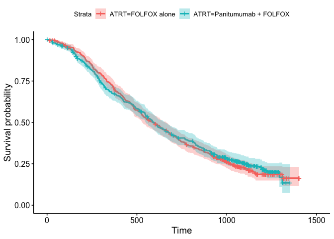

<!-- README.md is generated from README.Rmd. Please edit that file -->

# bis620.2023

<!-- badges: start -->

[](https://github.com/zihanwang00/bis620.2023/actions/workflows/R-CMD-check.yaml)
[](https://github.com/zihanwang00/bis620.2023/actions/workflows/test-coverage.yaml)
<!-- badges: end -->

The goal of bis620.2023 is to create a package that allows for the
visualization and a platform that facilitates viewers experience with
interacting with large and copious amounts of data. It serves to create
an interface where viewers can view the distinct features and attributes
of the data, specifically comparing to treatment and condition. We apply
some of the following operations: creating a world map of trials,
creating a condition keyword search, creating an intervention and
condition mapping, creating a pie chart for outcomes, having an ID count
for individual countries, and finally creating a picture of a word
cloud. All of these serve to facilitate the process of processing and
visualizing the data more easily as well as making it more interpretable
for the viewer to see as well.

## Installation

You can install the development version of bis620.2023 from
[GitHub](https://github.com/) with:

``` r
# install.packages("devtools")
devtools::install_github("zihanwang00/bis620.2023")
```

## Example

This is a basic example which shows you how to solve a common problem:

``` r
library(bis620.2023)
accel |> 
  head(1000) |> 
  plot_accel()
```

```{r}
library(dplyr)
unzip("countries.zip")
countries <- read.csv("filtered_countries.csv")
head(countries)


countries_df <- data.frame(countries)
filtered_countries <- countries_df %>%
  filter(!removed) %>%
  group_by(name) %>%
  summarise(n =n()) %>% 
  rename(ID_count = n)
names_countries <- filtered_countries$name
list(names_countries)
```

```{r}
count_country_id <- function(country, countries) {
  countries_df <- data.frame(countries)
  filtered_countries <- countries_df %>%
    filter(!removed) %>%
    group_by(name) %>%
    summarise(n = n()) %>% 
    rename(ID_count = n)
  
  # Find the row matching the specified country
  country_row <- filtered_countries %>%
    filter(name == country)
  
  # Print the row (if found)
  if (nrow(country_row) > 0) {
    print(country_row)
  } else {
    cat("Country not found.")
  }
}

count_country_id("United States", countries)

```



## Test Coverage Report

You can run the following code to see test report of the package.

``` r
library(covr)
report()
```
